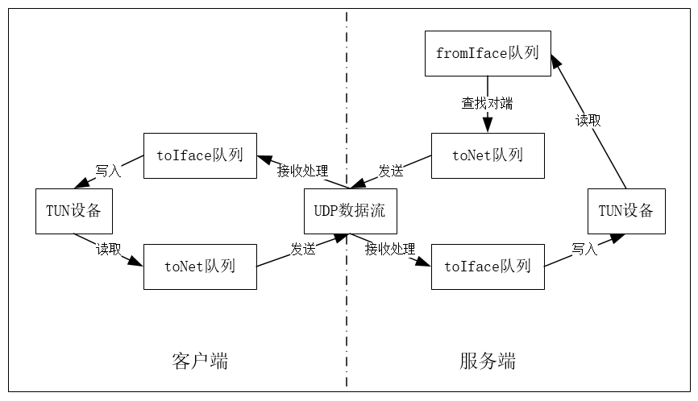
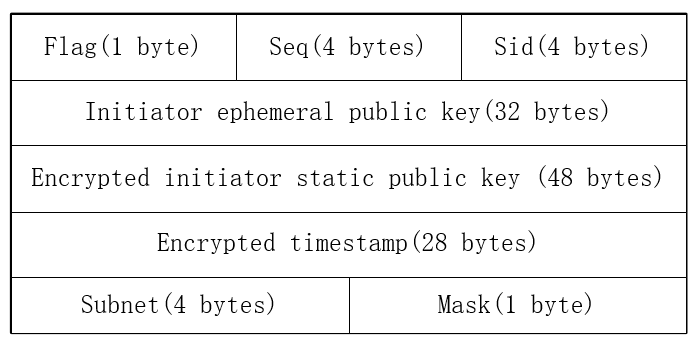

# DePlus Tunnel Protocol

DePlus隧道协议，参考Noise协议框架，用Go实现的C/S隧道协议，可用于异地组网。V1.0.0版本仅完成基本功能，不添加安全特性，后期在可视化平台实现安全模块化。

## 特性

- [x] 客户端/服务端模式
- [x] 用户以Web登录获取临时密钥作为握手前提
- [x] 基于Noise XX模式进行密钥派生
- [x] UDP隧道
- [x] 序列号缓冲机制，以平滑写入TUN设备的UDP数据流
- [x] 心跳机制和退出机制
- [x] .ini文件配置接口
- [ ] 开发可视化平台
- [ ] 安全模块化

## 下载

预编译Win/Linux二进制文件： https://github.com/tiqio/DePlus/releases/

从源码编译

```sh
git clone https://gitclone.com/github.com/tiqio/DePlus
```


## 基础使用

### 服务端

#### server.ini
```
[default]
# 服务端或者客户端。
mode = server

[server]
# 本地公网IP。
ip = "33.33.33.1"
# 本地HTTP服务端口。
httpPort = 51820
# 本地UDP服务端口。
udpPort = 51821
# 本地的隧道地址，会向客户端分发同一子网的IP。
tunnelIP = "10.10.10.1/24"
```

```sh
server -config server.ini 或者 server server.ini
```


### 客户端

#### client.ini
```
[default]
# 服务端或者客户端。
mode = client

[client]
# 服务端IP。
endIP = "33.33.33.1"
# 服务端HTTP服务端口。
endHttpPort = 51820
# 服务端UDP服务端口。
endUdpPort = 51821
# 客户端通告的子网。
subnet = "192.168.1.0/24"
# 要通过隧道进行通信的子网。
otherSubnet = "192.168.2.0/24"
```

```sh
client -config client.ini 或者 client client.ini
```

## 设计方案


### 密钥派生

Noise Protocol Framework：http://noise.protocol.org/noise.pdf


### 协程组织

- TUN设备的[写入]和[读取]同属协程handleInterface，在客户端和服务端均有实现。
- UDP数据流的[发送]和[接收处理]同属协程handleUDP，在客户端和服务端均有实现。
- [查找对端]属于协程forwardFrames，仅在服务端实现。




### 报文交互流程
- 握手阶段：完成密钥派生，路由添加和TUN设备启动。
  - Login：通过用户名和密码从服务端获取独立的临时公钥。
  - Handshake Initiation：利用对端的临时公钥，本地的临时密钥对和静态密钥对进行加密。需要一并传入本地子网让服务端添加中转路由。
  - Handshake Response：利用对端的临时公钥和静态公钥，本地的临时密钥对和静态密钥对进行加密。需要在本地IP C类地址池中取出一个未被使用的隧道地址供客户端使用。
  - Handshake Ack：用于告知服务端，客户端握手成功。
- 传输阶段：利用TUN设备进行隧道传输。
  - Transport Data：从TUN设备中获取要被封装的数据包，加密，并通过UDP数据流传输。
  - Heartbeat：在客户端超时时释放服务端资源。
  - Finish：在客户端主动停止时释放服务端资源。
    


### Handshake Initiation 报文


- Flag：_FLG_HSF_
- Seq：序列号，为进入TUN设备的流量缓冲，Seq大的优先处理。
- Sid：会话ID，用于在服务端区分多个客户端。
- Initiator ephemeral public key：_EiPub_
- Encrypted initiator static public key：_Enc-EiPub_
- Encrypted timestamp：当前的时间戳，用于防止重放攻击。
- Subnet：客户端通告的子网。
- Mask：子网的掩码位数。

### Handshake Response 报文


- Flag：_FLG_HSH | FLG_ACK_
- Seq：序列号，为进入TUN设备的流量缓冲，Seq大的优先处理。
- Sid：会话ID，用于在服务端区分多个客户端。
- Encrypted responder static public key：_Enc-ErPub_
- Tunnel IP：为客户端分配的TUN设备地址。
- Mask：TUN设备地址的掩码位数。

### Transport Data 报文


- Flag：_FLG_DAT_
- Seq：序列号，为进入TUN设备的流量缓冲，Seq大的优先处理。
- Sid：会话ID，用于在服务端区分多个客户端。
- Encrypted Data：被封装的数据包。

### Handshake Ack & Heartbeat & Finish 报文


- Flag：_FLG_HSH | FLG_ACK_ & _FLG_HBT_ & _FLG_FIN_
- Seq：序列号，为进入TUN设备的流量缓冲，Seq大的优先处理。
- Sid：会话ID，用于在服务端区分多个客户端。

## 实验环境

### EVE-NG

三台CentOS8分别作为Server、Client1和Client2。Client1和Client2分别建立同Server的通道。客户端虚拟化出两个内网主机可以互相通信，实验成功。
```
换源并下载podman：
cd /etc/yum.repos.d
rm -rf *
wget -O /etc/yum.repos.d/CentOS-Base.repo https://mirrors.aliyun.com/repo/Centos-vault-8.5.2111.repo
sudo yum clean all
sudo yum makecache
yum install docker -y
sudo systemctl start podman
sudo systemctl enable podman

保证Client可以和公网上的Server通信。

Client1：
podman network create client1-network --subnet=192.168.1.0/24
podman network inspect client1-network
podman run -it --name client1-host --network client1-network docker.io/nicolaka/netshoot:latest

Client2：
podman network create client2-network --subnet=192.168.2.0/24
podman network inspect client2-network
podman run -it --name client2-host --network client2-network docker.io/nicolaka/netshoot:latest

Server：
server server.ini

Client1：
client client1.ini

Client2：
client client2.ini

之后，client1-host和client2-host可以相互通信。
```
